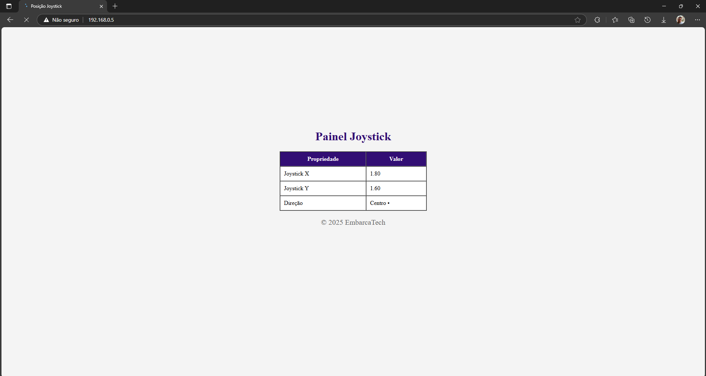
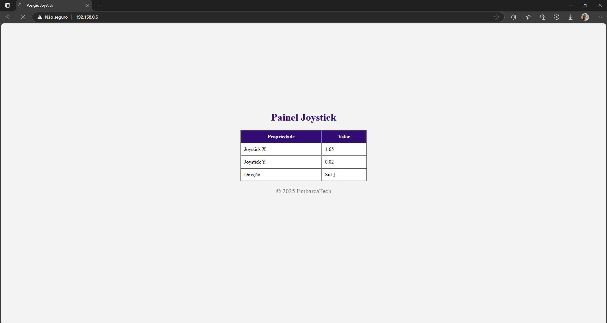
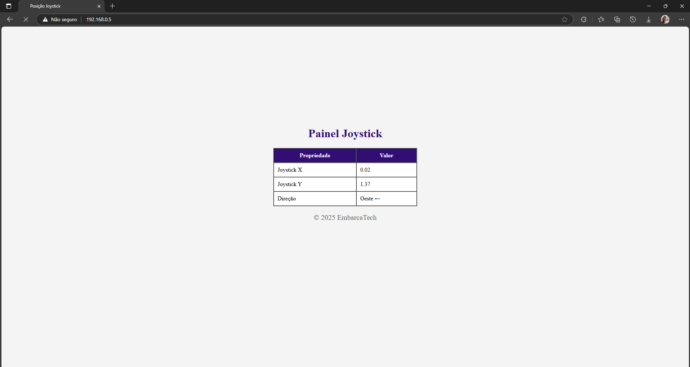
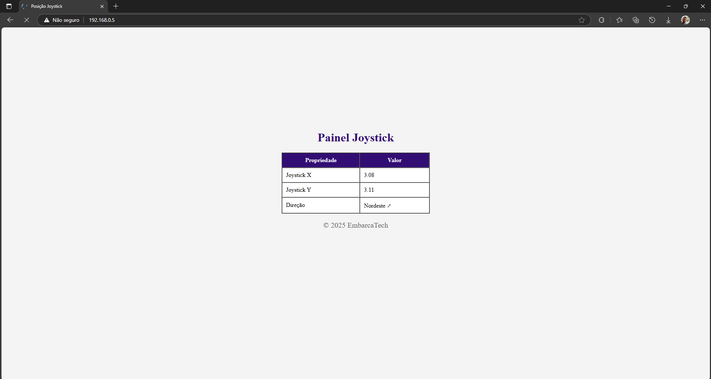
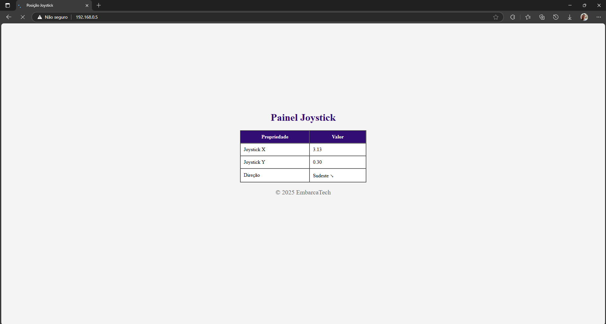
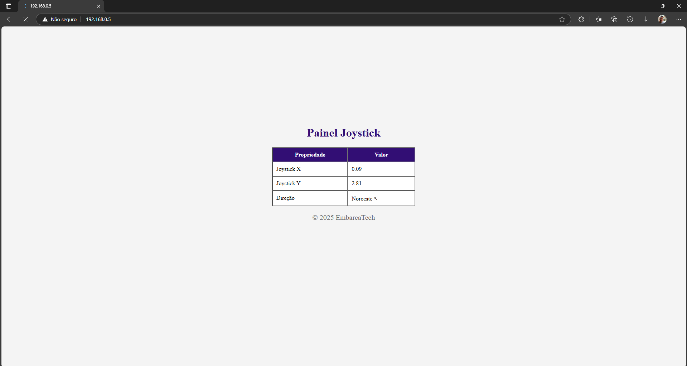

# **Monitoramento do Joystick com Servidor Web**

Este projeto implementa um sistema para monitorar a posição de um joystick analógico conectado à placa **BitDogLab**. Os dados das coordenadas X e Y do joystick são enviados em tempo real para um servidor web via Wi-Fi, permitindo a visualização das informações em um navegador. Além disso, o sistema interpreta as coordenadas para determinar a direção correspondente em uma rosa dos ventos imaginária.
---

## **Funcionalidades**

- **Leitura em Tempo Real:** Captura as coordenadas X e Y do joystick analógico.
- **Servidor Web:** Exibe as informações do joystick em uma página HTML acessível via navegador.
- **Rosa dos Ventos:** Determina e exibe a direção correspondente (Norte, Sul, Leste, Oeste, Nordeste, Sudeste, Noroeste, Sudoeste).
- **Atualização Contínua:** Os dados são atualizados automaticamente a cada segundo.

---

## **Componentes Utilizados**

| **Componente**           | **Descrição**                     | **Conexão**          |
|---------------------------|-----------------------------------|----------------------|
| **Placa BitDogLab**       | Microcontrolador principal        | -                    |
| **Joystick Analógico**    | Dispositivo de entrada analógico  | GPIO 26 (X), GPIO 27 (Y) |
| **Módulo de Conexão Sem Fio** | Infineon CYW43439               | Integrado ao Pico W  |
---

## **Como Funciona**

1. **Inicialização:**
   - O joystick é configurado para leitura das coordenadas X e Y através dos pinos ADC da placa.
   - O módulo Wi-Fi é inicializado e conectado à rede configurada.

2. **Leitura do Joystick:**
   - As coordenadas X e Y são lidas em tempo real e convertidas para valores de tensão (0V a 3.3V).

3. **Determinação da Direção:**
   - A função `get_joystick_direction` interpreta os valores das coordenadas para determinar a direção correspondente na rosa dos ventos.

4. **Servidor Web:**
   - Os dados do joystick (X, Y e direção) são enviados para um servidor web e exibidos em uma página HTML.

---

## **Como Executar**

### **Pré-requisitos**
- Placa **BitDogLab** ou **Raspberry Pi Pico W**.
- Joystick analógico conectado aos pinos GPIO 26 (X) e GPIO 27 (Y).
- Ambiente de desenvolvimento configurado com o SDK do Raspberry Pi Pico.

### **Passos**
Clone este repositório:
```bash
git clone https://github.com/otaviossousa/joystick-control-webserver.git
cd joystick-control-webserver
```


### **Configure o arquivo `WIFI_SSID` e `WIFI_PASSWORD` no código para sua rede Wi-Fi:**
```bash
#define WIFI_SSID "SuaRedeWiFi"
#define WIFI_PASSWORD "SuaSenhaWiFi"
```

### **Compile o Projeto**
```bash
cd Joystick_Control_Webserver
mkdir build
cd build
cmake -G "Ninja" ..
cmake --build .
```

## **Exemplo de Saída do Web Server**

Abaixo estão exemplos das direções exibidas no servidor web, com base na posição do joystick:

### **Centro**


### **Norte**


### **Leste**


### **Sul**


### **Oeste**


### **Nordeste**


### **Sudeste**


### **Noroeste**


### **Sudoeste**
